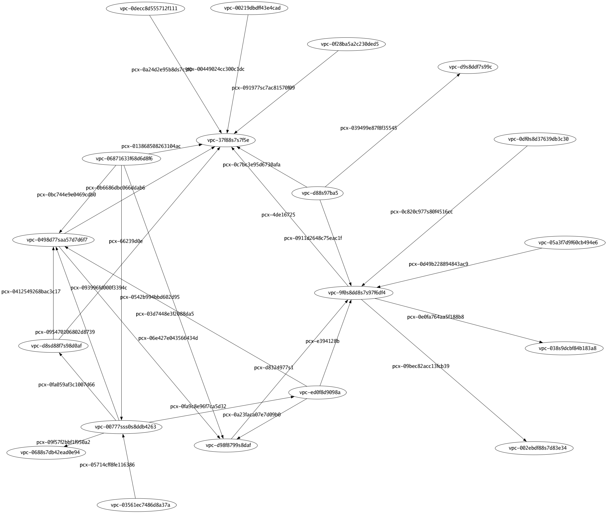

# AWS VPC Peering Visualizer (WIP)

A simple cmd tool to visualize your AWS VPC Peering topology

## How to use

```
aws vpc describe-vpc-peering-connections --output text | vpcpeeringviz --output /path/to/graph.png --format png
```

Valid formats: `svg, png, jpg`

## Example Output


